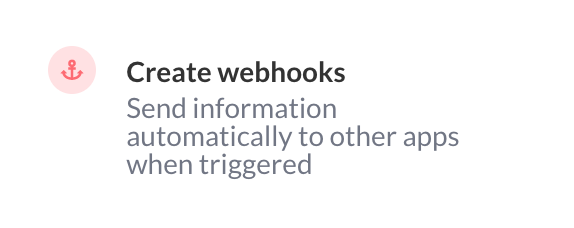
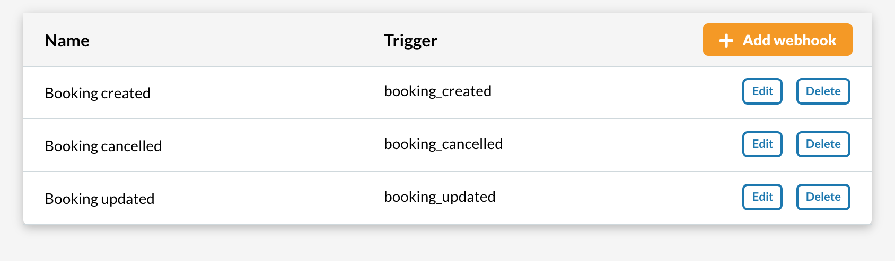
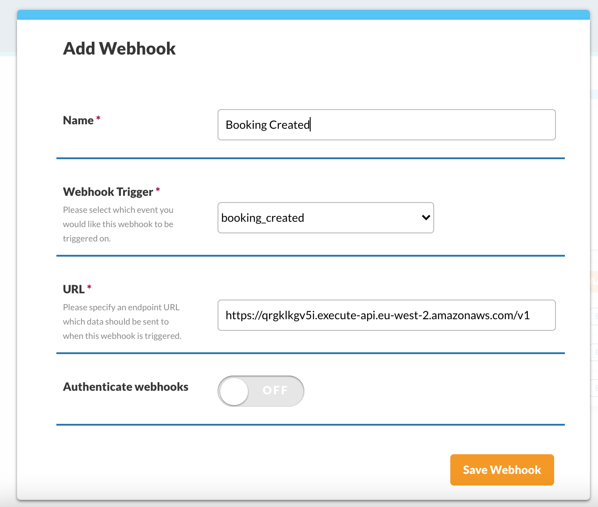
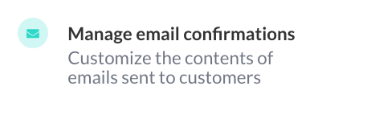
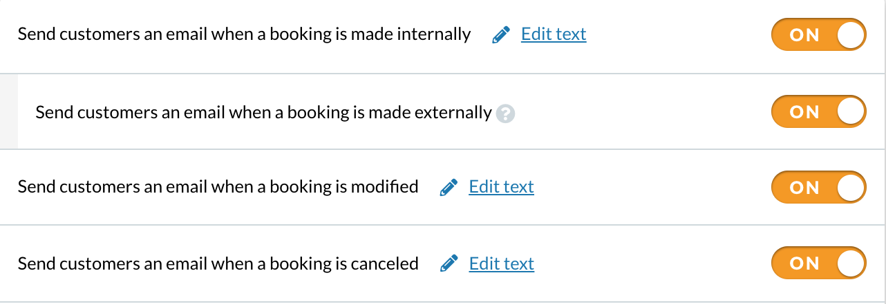

Pour synchroniser le création/modification/suppressions d’évènements Appointedd et les événements Bleeker,  il suffit d’associer le webhook Bleeker sur votre compte Appointedd.

### 1. Dans le menu Appointedd, cliquez sur Connect > Create Webhooks.

### 2. Cliquez sur Add Webhook.

### 3. Créez les  webhooks en insérant le lien du webhook Bleeker dans le champ URL.

> [Webhook Bleeker](https://qrgklkgv5i.execute-api.eu-west-2.amazonaws.com/v1)

#### 4. Dans le menu Appointedd, cliquez Email & SMS > Manage Email Confirmation.

### 5. Cliquez sur le lien Edit text associé à l’email de confirmation.

### 6. Dans le template, au niveau du bouton de connexion au live, insérez le l’URL de connexion.

L'URL de connexion est transmise par ***Bleeker*** dans un second temps.