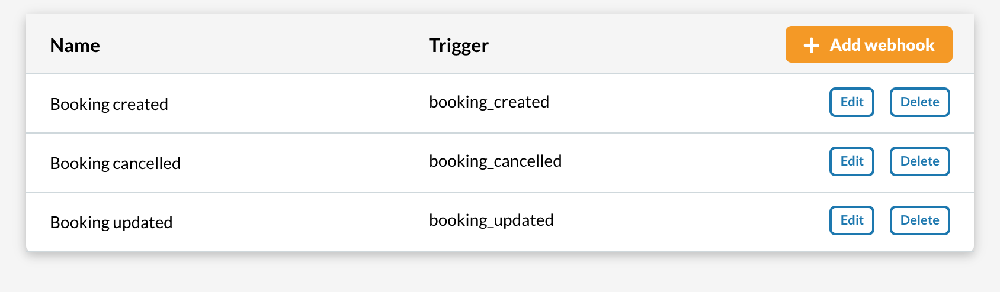
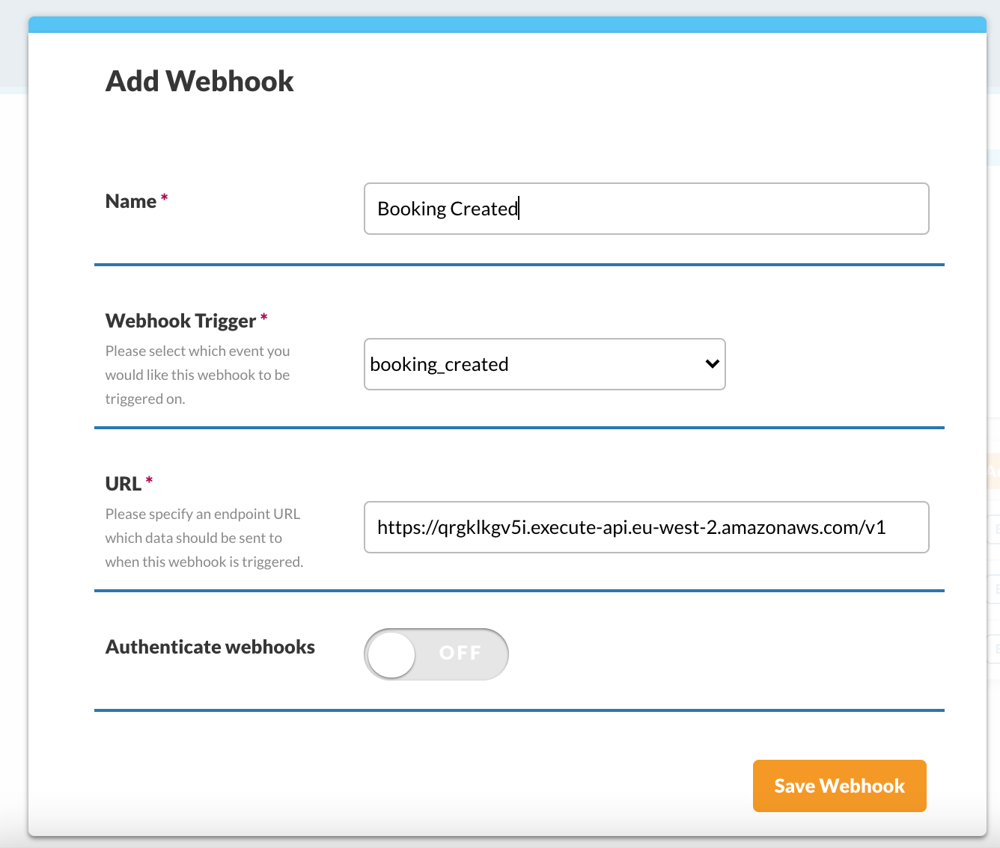
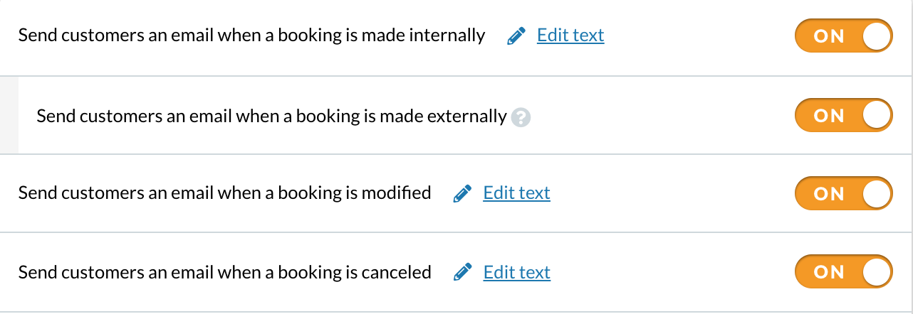

# Appointedd integration

To synchronize the creation/modification/deletion of Appointedd events and Bleeker events, simply link the Bleeker webhook to your Appointedd account.

### 1. In the Appointedd menu, click on Connect > Create Webhooks.

### 2. Click on Add Webhook.

### 3. Create the webhooks by inserting the Bleeker webhook link in the URL field. 

> [Webhook Bleeker](https://qrgklkgv5i.execute-api.eu-west-2.amazonaws.com/v1)

#### 4. In the Appointedd menu, click on Email & SMS > Manage Email Confirmation.

### 5. Click on the Edit text link associated to the confirmation email.

### 6. In the template, at the live connection button, insert the connection URL.

The connection URL is then transmitted by ***Bleeker***.